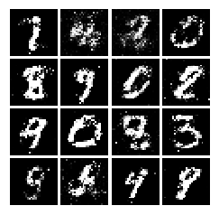
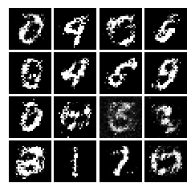
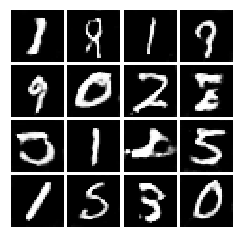

This demonstrates running a fully connected layer GAN , a Least Square GAN and a Deep Convolutional GAN on MNIST dataset to generate some excellent fake data .

### Samples generated from the GANs

* Vanilla GAN generated

* LSGAN generated

* DCGAN generated 

